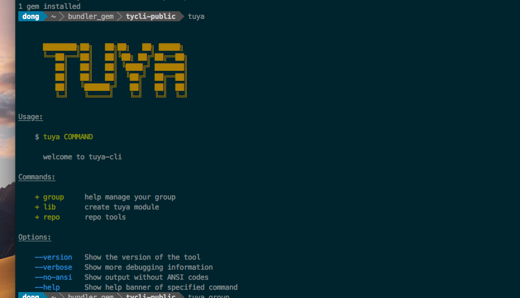
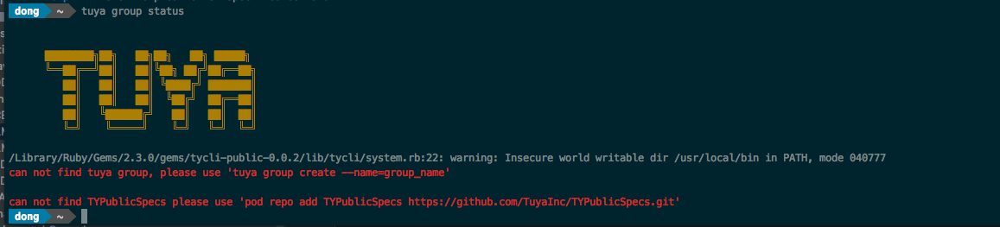
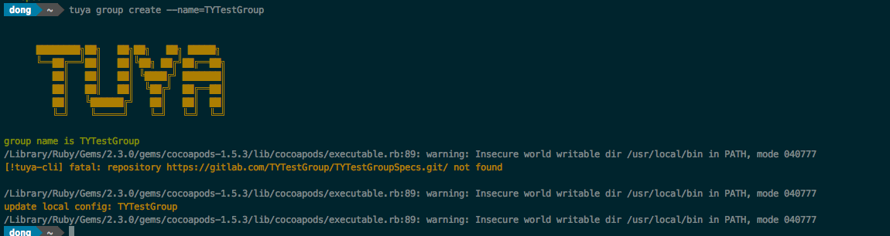
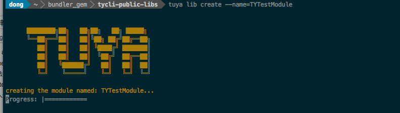
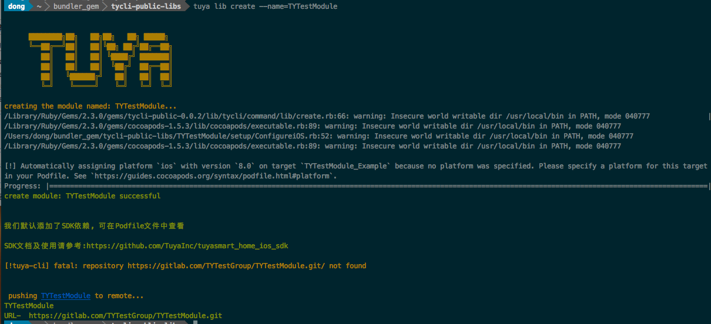
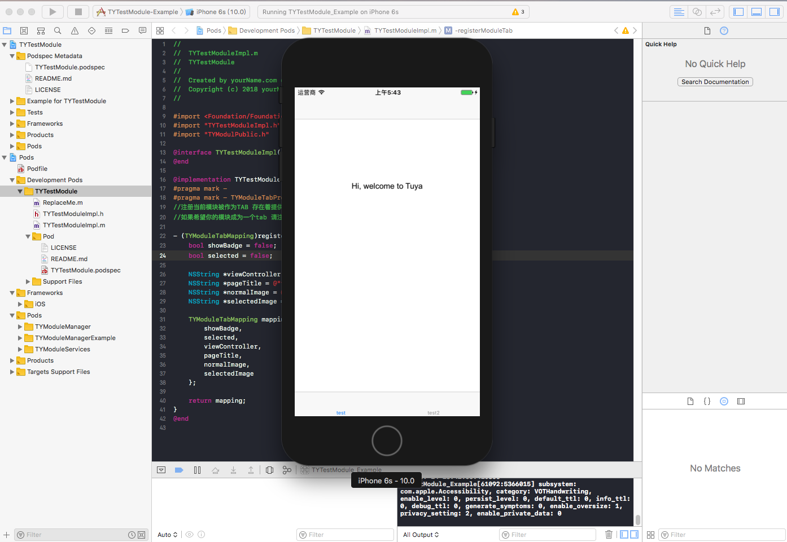
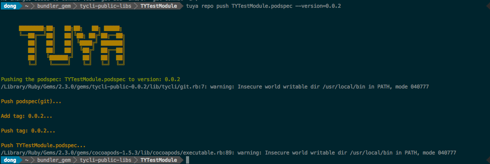

### 前言

我们提供了模块化合作方式, 提供我们一个gitlab的账号(不需要密码),我们会给你开一个以该账号为owner的gitlab group.

基于Cocoapods  与 我们的模块化协议, 你开发的模块将会存放在这个group, 每个模块独立一个私有库

###tuya-cli-public


为了更加方便的采用上述的开发方式, 我们提供了tuya-cli-public 这样一个工具来帮助我们完成全部的操作, 我们的精力可以更加多的放在业务代码实现上

tuya-cli-public 是一个基于Cocoapods进行二次开发的一个工具 https://cocoapods.org/

####安装

我们的安装有两个前提:

* 目前tuya-cli-public只发布在 https://rubygems.org 源, 确保本地添加了该源
* 确保本地正确安装并能正常使用Cocoapods

```
$gem sources      

*** CURRENT SOURCES ***

https://gems.ruby-china.com/
https://rubygems.org
```


执行: gem install tycli-public 进行安装

```
$ gem install tycli-public 

Successfully installed tycli-public-0.0.2
Parsing documentation for tycli-public-0.0.2
Installing ri documentation for tycli-public-0.0.2
Done installing documentation for tycli-public after 0 seconds
1 gem installed

以上安装成功
```


#### 主界面

安装成功后 $ tuya 




####tuya-cli-public命令说明

```
├── command 							tuya   					根命令
│   ├── group             				tuya group 				涂鸦开发环境管理
│   │   ├── create						tuya group create  		创建专有spec/安装tuya公开spec
│   │   ├── init						tuya group init     	只安装不创建专有spec
│   │   └── status						tuya group status		检查当前repo状态, 提供处理方案
│   ├── lib								tuya lib 				涂鸦模块化模板管理
│   │   ├── create						tuya lib create     	创建涂鸦模块化工程开发模板
│   │   └── create-simple				tuya lib create-simple  创建简单组件模块(非模块化模板)
│   ├── repo							tuya repo				组件版本管理
│   │   ├── init						tuya repo init			暂不开放
│   │   ├── lint						tuya repo lint			暂不开放
│   │   └── push						tuya repo push 			部署模块版本
```

 

### 完整使用流程

演示一个完整的模块开发流程

#### 环境搭建

* tuya group status

  > 检查本地, repo 状态, 首次安装本地必然没有, 于是我们会看到下面的界面

  


* tuya group create

  >  执行  tuya group create --name=group_name    group_name跟我们的开发人员沟通根据需要会提供一个名字   我们以TYTestGroup为例

  

  >  此时我们再次执行 tuya group status 将会看到我们本地已经安装并在远端创建了所需要的repo

  `ok此时我们的环境已经配置完成`

####模块开发

* tuya lib create

  >  环境搭建完成后, 我们便可以正式的开发一个模块,  可以是我们的首页, 或者是个人中心, 或者是任意的我们想要开发的模块, 名字我们可以自己取,假设我们要创建开发一个名为TYTestModule 的模块, 我们执行:tuya lib create --name=TYTestModule

  

  >这一步在执行目录下 会创建一个 名叫TYTestModule 的工程, 并且会依赖生成我们模块化的demo 生成完成后自动打开xcode, 并且会将该工程自动提交到远程gitlab, 完成后如下图, 会输出远程仓库地址等信息, 我们已经可以再此工程上正常开发

  

  > 我们回到自动打开的xcode工程, 看左边目录结构, 如下:

  

  > 这是一个标准的Cocoapods 工程目录
  >
  > ​
  >
  > 目录: Development Pods, 该目录存放我们将要开发的业务代码
  >
  > TYTestModuleImpl:  这个自动产出的文件非常重要,  实现了TYModuleProtocol 协议, 描述一个模块提供的能力, 具体的内容查看Pods/TYModuleManagerExample
  >
  > ​
  >
  > Pods/TYModuleManagerExample: 这是一个模块化协议的具体使用demo,里面有较详细的使用方式
  >
  > Pods/TYModuleServices: 这里存放我们提供可供使用的业务功能, 比如:打开面板, 打开二维码等20多个模块的各个功能
  >
  > Pods/ TYModuleRoutes: 暂时未提供, 不久将提供该模块, 该模块会描述全部可用短链

  >  
  >
  > 还有一点非常重要, 这是一个可以测试模块的功能, 将模块最终要显示在涂鸦的页面替换成 Hi, welcome to Tuya 这个页面, 在该工程可正常运行的工程,最终集成涂鸦后也能正常运行, 如果不需要成为一个tab显示在涂鸦内的, 那么可以在Hi, welcome to Tuya 这个页面写一些测试方法测试你的功能


* tuya repo push

  > 我们开发完功能后, 打算部署一个版本到专属的仓库时, 需要最终集成打出包 这一步是必须且不可跳过的一步, 全部自动完成 如 我们执行  tuya repo push TYTestModule.podspec --version=0.0.2

  

  > 如图, TYTestModule的0.0.2版本已经正常发布, 当然前提是 模块代码是正确的, 不然无法发布, 并且会抛出错误

  ​